# Table of Contents
- [Introduction](#Introduction)
- [Anatomy](#Anatomy)
- [Hair type](#Hair-type)
- [Hair type care](#Hair-type-care)
- [Hair concerns](#Hair-concerns)
- [Hair care products](#Hair-care-products)
- [Hair styling products and tools](#Hair-styling-products-and-tools)
- [Hair care routines](#Hair-care-routines)
- [Dandruff treatment](#Dandruff-treatment)
- [Bleached/dyed hair care](#Bleached/dyed-hair-care)
- [Ingredients](#Ingredients)
- [Hydration and oils](#Hydration-and-oils)
- [FAQ](#FAQ)

# Introduction

This guide is a comprehensive approach to hair care (not body hair). While it may seem simple to just use a shampoo and a conditioner, some people either don't have the hair they desire. There are limits to what is possible, but with proper hair care you can get beautiful hair that will make everyone envy you.

The internet is full of useful information, but not all information is valid for everyone. This guide is going to do its best to cover as much information as possible for each situation.

While this guide is mostly useful for long hair, same principles apply to short hair as well. It is up to the reader to decide what are are their goals and what kind of approach to hair care they want to take.

# Anatomy

Those little things that cover your head and tickle your face - those are individual protein filaments that grow inside your skin. From the anatomy standpoint hair structure is quite simple: outer layer is the cuticle, the inner layer is the cortex and in context of hair care other parts are not as important.

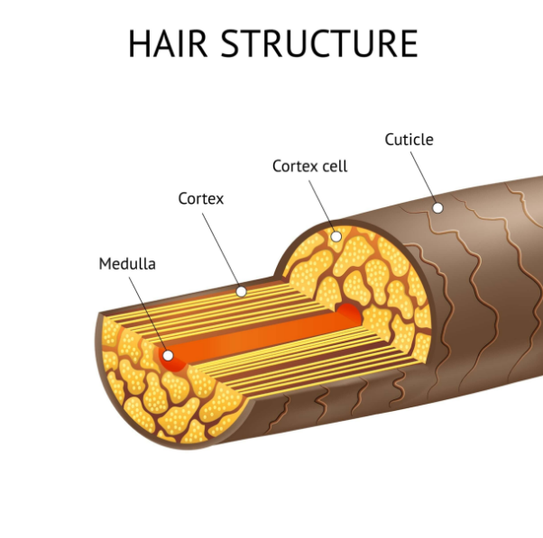

Hair strands are small, but these small objects pack a very important type of protein - keratin. Your hair strand's cortex is made out of keratin, which is made out of amino acids.

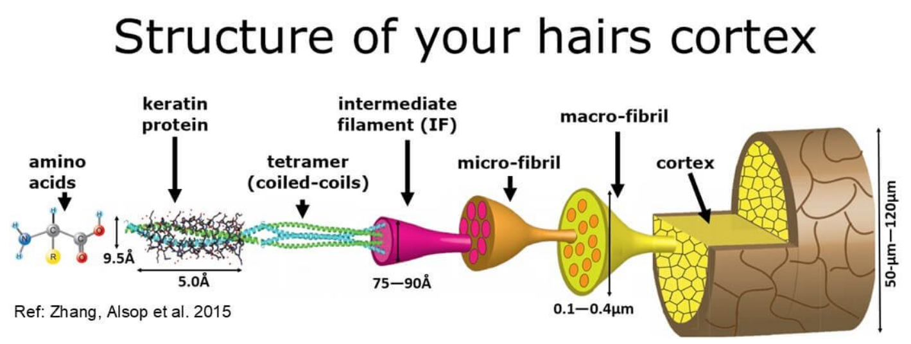

In this guide we are going to cover a lot about hair that looks goods, appears smooth and is easy to manage. Your hair cuticles are going to affect a lot of your hair's appearance and your hair's manageability. The way your hair cuticles work is that they raise and lower depending on moisture (or direct water), this process is essential for the hair to either absorb needed hydration or prevent the hair's cortex from being damaged.

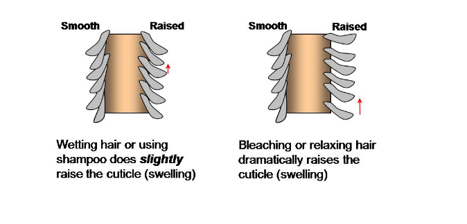

Hair care is mostly going to be focused on finding the right amount of hydration to keep the "flaps" of hair cuticles lowered and feeding the cortex enough nutrients so it can strong. In context of hair care, there is not much you should be aware, hair might be made out of complex amino acids, but caring for them is quite straight forward.

# Hair type

Before you dive into the world of endless hair care products, you should first understand your own hair type. It is very important to know what your hair needs before you start any kind of treatments. If you over-do one kind of treatment, you can damage your hair even though the product is designed to strengthen your hair strands. Read below to determine your hair type.

**Hair density:**
Determined by how many hair strands you have and how close they are on your scalp. There are usually three levels of density than can be determined by looking at your scalp in the mirror:
- You can easily see your scalp = thin density hair
- You can partly see your scalp = medium density hair
- You can hardly see your scalp = thick density hair

Note: Thick hair usually has the most volume.

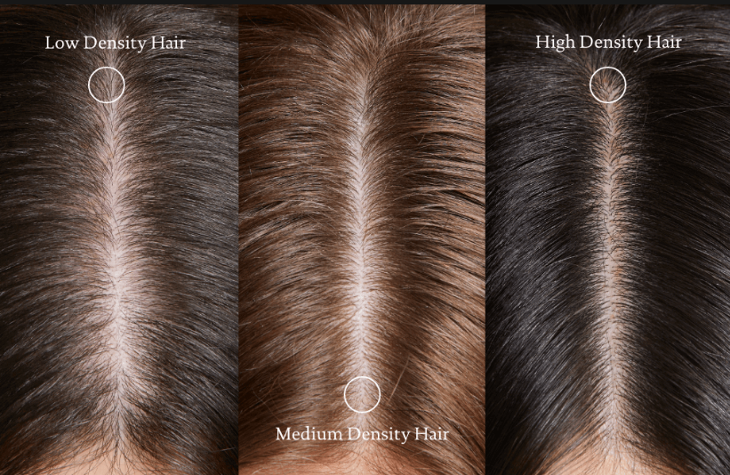

**Hair diameter:**
Refers to the thickness of each individual hair strand. To determine the thickness level of your hair strands, take one hair strand and place it between your index finger and your thumb. An alternative way is to compare it to a regular thickness thread used for sewing. There are usually three levels of hair thickness:
- You can barely feel the hair strand between your fingers / Hair is smaller than the thread = thin hair
- You can slightly feel the hair strand between your fingers / Hair is about the same thickness as the thread = medium thickness hair
- You can easily feel the hair strand between your fingers / Hair is thicker than the thread = thick hair

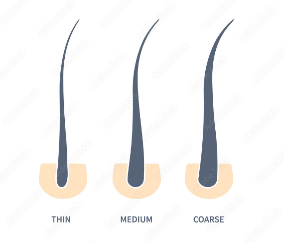

**Hair porosity:**
Refers to the hair's ability to absorb moisture or hair care products. High porosity means that your hair is able to absorb more moisture. Low porosity means hair is not able to fully absorb moisture. To determine your hair's porosity, take one hair strand and submerge it in a glass of water. There are usually three levels of hair porosity:
- The hair strand sinks to the bottom of the glass immediately = High porosity
- The hair strand is floating between the water = Medium/normal porosity
- The hair strand is floating on the surface of the water = Low porosity

Note: If your hair stays wet for a long time after washing them, then it is most likely you have low porosity hair.

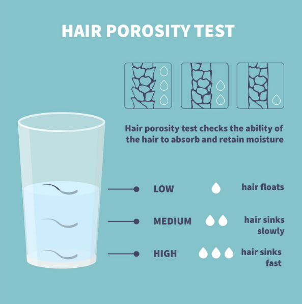

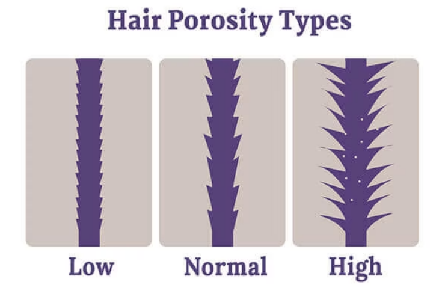

**Hair greasiness:**
Refers to the hair's level of oiliness or how much sebum does your scalp produce. To determine your hair's level of greasiness, wash your hair thoroughly before bed and let it air dry. When you wake up, use a tissue and press it against your scalp around your head's crown area and behind your ears. The oiliness level of the tissue is going to determine your hair's greasiness level:
- There is a significant amount of oil on the tissue = Oily hair
- There is slight patches of oil on the tissue = Normal hair
- There is no oil on the tissue = Dry hair
- There is no oil on the crown area, but some oil behind your ears and above the temple area = Combination hair

Note: It is possible to have an oily scalp and dry hair strands.

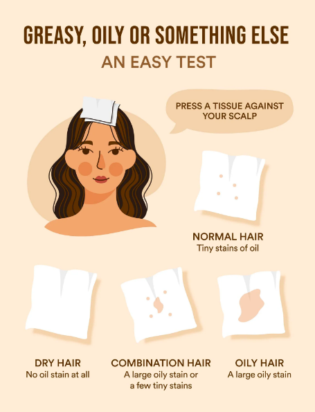

**Hair elasticity:**
Refers to how much your can be stretched before it breaks. To determine your hair's elasticity level, take a wet hair strand and pull it slowly before it breaks. There are usually three levels of hair elasticity:
- Hair stretches up to 50% of its original length before breaking = High elasticity
- Hair stretches somewhat before breaking = Medium elasticity
- Hair snaps almost immediately when pulled = Low elasticity

Note: Highly elastic hair is also considered strong and healthy hair.

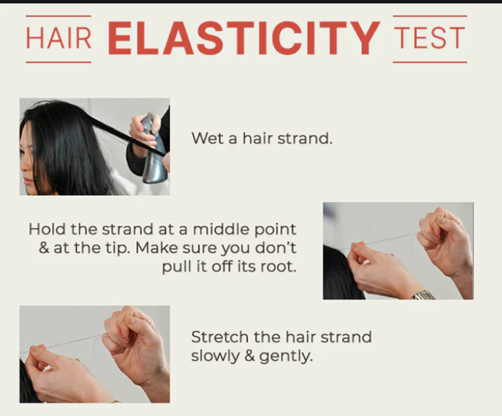

**Curl pattern:**
Refers to a certain pattern your hair has naturally. Your hair follicles and and the hair shaft is going to determine your curl pattern. Observe your hair to determine the curl pattern:
- Straight hair (Type 1): Your hair is straight from the roots to the ends, usually hair is thin and soft, but also has higher levels of greasiness

- Wavy hair (Type 2): Your hair has very slightly curls near your hair ends, usually hair is medium thickness and are less soft. There are a few subtypes possible. Type 2A is thin wavy hair. Type 2B is medium wavy hair. Type 2C is thick wavy hair

- Curly hair (Type 3): Your hair resembles a "S" pattern. Hair is highly frizzy and tangles easily. THere are a few sub types possible. Type 3 has loose curls. Type 3B has medium curls. Type 3C has tight curls

- Kinky/Coily hair (Type 4): Your hair resembles a rough "Z" pattern. Hair is prone to damage, has high density, curls are very tight, but is soft. There are a few subtypes possible: Type 4A is soft. Type 4B is wiry. Type 4C is very wiry

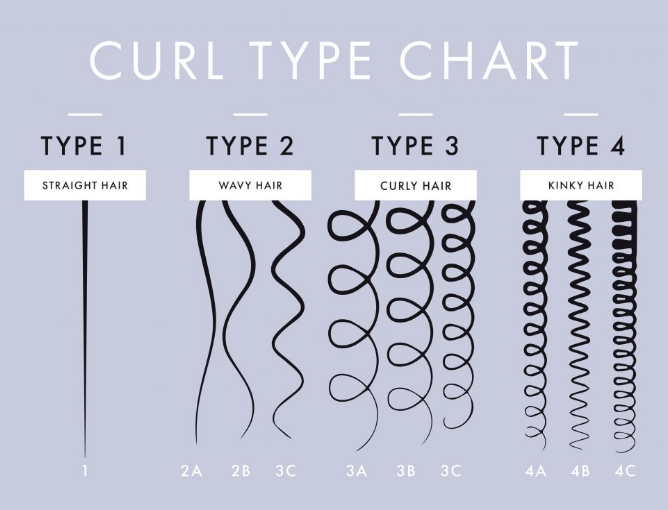

# Hair type care

When people are looking for hair care tips, they want to fix a specific concern, most commonly it is dull, dry, weak hair, but each hair type requires a different kind of care. When improper hair care is used, your hair can be damaged more severely. To make your hair look healthy and not cause more damage read below.

**Hair density:**
- Low density: Avoid using heavy products such as oils and heavy conditioners since the extra weight will weigh down your hair and make it more scarce. In case you want to treat hair loss, then there are not many options available without a prescription (most products have not shown any significant changes in studies), most popular is minoxidil (has clinically shown results, has not shown any significant results on men's beards). Minoxidil is only effective if it is being used continuously. There are other treatment options, contact your doctor for your options.
- Medium density: Most light and medium-weight products can be used. Gels, jellies, mousses, foams, styling creams can be used to add more volume. Usually does not require much styling. Dry shampoos can be used to quickly restore volume.
- High density: Usually high density hair has thin hair strands, using heavy products can weigh down your hair and decrease the volume. Some people do want to reduce their volume therefore heavy products such as creams and butters should be used. Usually Layered hair cuts are preferred.

**Hair diameter:**
- Thin hair: Heavy products weigh down your hair, avoid using oils and heavy conditioners. If you style your hair with heat, then heat protection is a must. Use a wide tooth comb to carefully detangle your hair. Opt for shampoos and conditioners that are designed for adding thickness to your hair. Consider using dry shampoos to restore volume on daily basis. Consider having shorter hair cuts. Consider using light mousse on your roots and ends.
- Medium thickness hair: Most regular shampoos and conditioners are going to work fine. Detangle your hair on a regular basis.
- Thick hair: Wash your hair less often. Be careful with your hair when it is wet as it is more prone to damage when wet. Consider using various hair oils. Opt for layered hair cuts. Avoid over-drying your hair. Consider deep conditioning. Cut your hair end on a regular basis.

**Hair porosity:**
- High porosity: Hair is highly prone to damage since high number of pores in your hair allows to absorb various products quickly. High porosity hair is almost never hydrated enough and hydrating it is difficult since various chemicals easily can damage the hair. Opt for highly moisturizing products. Avoid harsh chemicals in your products. Look for products that seal in moisture and protects it. Avoid heat and chemical treatments. Avoid products with humectants. Always use a conditioner.
- Medium porosity: Hair treatment can be done easily since hair is able to seal in moisture and other chemicals by itself. Does not have very specific needs, but regular conditioning still must be done.
- Low porosity: Most products build up on the hair strands rather than being absorbed. Hair can feel dry and brittle. Avoid or limit protein treatments since they can make your hair even more dry. Avoid silicone in your products since it prevents moisture to be absorbed properly. Opt for water-based products and other products that do not create build-up. Avoid heat styling since it can make your hair ever dryer. Avoid heavy oils. Your hair needs every bit of moisture it can get.

Note: Protein treatments are good for your hair as it can make it stronger and healthier looking, but too much can make the hair dryer since it prevents moisture from entering the hair strand. Limit the amount of protein treatments.

**Hair greasiness:**
- Oily hair: Consider washing your hair 4-5 times a week. 
- Normal hair: Consider washing your hair 1-2 times a week.
- Dry hair: The dryness indicates that your hair does not retain moisture. Avoid shampoos with sulfates and other harsh chemicals. Use as hydrating hair care products.
- Combination hair: Consider using different products on different parts of your hair.

Note: It is possible to have an oily scalp and dry or frizzy hair. In such cases you can use different kinds of shampoos for the scalp and the strands or even skip the shampoo for the strands all together.

Note: It can be very easy to mistake dandruff (oil buildup) with scalp dryness. If anti-dandruff product does not give you the desired results, then consider consulting your doctor.

**Hair elasticity:**
- High elasticity: Considered as the healthiest and strongest hair. Has a good amount of shine. Usually thin hair is highly elastic hair. When stretched, it might not return to original length. Has too much moisture. Consider using protein treatments. 
- Medium elasticity: Most women have this type of hair. Can be strengthen by using hair masks and oils. Consider using deep conditioning to hydrate hair strands deeply.
- Low elasticity: Hair lacks hydration. Use highly hydrating hair care products. Use deep conditioning regularly, avoid chemical treatments. Consider using water-based products and leave-in conditioners. 

**Curl pattern:**
- Straight hair (Type 1): Avoid using too much product. Detangle hair on regular basis. Avoid brushing hair when wet. Use a mild shampoo.
- Wavy hair (Type 2): Keep your hair moisturized, consider deep conditioning at least once a week. You can use your fingers to detangle your hair before brushing. Only brush your hair when it has been conditioned. Use lightweight styling products.
- Curly hair (Type 3): Avoid heat styling. Use shampoo less often. Use hair masks weekly. Use a diffuser when blow-drying. Use a wide tooth comb. Avoid heavy products. Wash your hair in cold water.
- Kinky/Coily hair (Type 4): Consider using hair oils and hair butters. Avoid products with silicone. Use a lot of deep conditioning. Avoid combing hair dry.

Note: In general you should not comb your hair when it is wet as it is very prone to breakage when wet. Only very curly hair should comb their hair when it is wet.

# Hair concerns

For some letting hair grow and getting a trim is enough to keep hair healthy, but for some it is a bit more difficult. Before jumping into getting all sorts of hair care products, consider the following list to know to what you should pay attention:

**Dandruff:**
One of the most common hair concerns. The topic is quite vast, but quite simple in most cases. Refer to appropriate chapter for dandruff treatment.

**Hair loss:**
Also referred as thinning hair, is quite common in both males and females. For men this is also called "balding". The cause of hair loss can be complex including genetics, but it can also be caused due to stress, medication and hygiene. Consider changing up your diet, reduce stress and properly wash your scalp. Hair loss can also be caused due to heat styling and chemical treatments. Consider using a shampoo designed to treat hair loss. It is also highly recommended to speak to your doctor about your hair loss and seek other possible treatments.

**Dry hair:**
Very common hair concern for many women, but can be found among men as well. Usually is caused by using either the wrong shampoo or using too much shampoo, can also be caused by heat styling and various chemical treatments such as bleaching, dying and keratin treatments. Consider using a mild shampoo, look for a shampoo with pH around 5.5, use hair masks frequently and make sure, consider using hair oils as well.

**Split ends:**
Happens when the ends of your hair strands split into two parts and start growing as two hair strands connect to a one hair strand. This is usually caused from dry hair, over brushing, heat styling and other factors that damage hair. There is no way to fix split ends, you can only cut off the parts that have are now split, you should also visit a hair saloon frequently to remove split ends. These split ends make your hair hard to manage and prevent your hair from growing healthy. To prevent split ends you need to make sure your hair receives all the moisture it needs and is not abused too much from heat styling or excessive brushing.

**Oily hair:**
Caused by your scalp overproducing natural hair oil. Factors that can contribute to oil overproduction include genetics, but can also be caused by dirt and hair care product build-up, diet and other factors. Usually this can be fixed by using a shampoo that is designed for oily hair and increasing the hair wash frequency.

**Frizzy hair:**
Happens when your hair strands are trying to absorb moisture from the environment and opens up cuticles, as a result your hair is no longer smooth and becomes hard to manage. Frizzy hair can be caused by genetics too. To fix frizzy hair you should focus on hydrating hair as much as possible by using various hair masks, conditioners and hair oils. There are anti-frizz sprays that coat the hair to make it smooth, but that is only a temporary fix, you should focus on hydration instead.

**Dull hair:**
Characterized as hair that lacks luster, looks frizzy and lacks shine. This is usually caused by chemical treatments and heat styling. To fix dull hair consider using the proper hair care products that hydrate your hair. Consider using cold water after you rinsed your hair to make your hair smoother.

**Prone to breakage:**
If your hair breaks easily, especially when combing hair, then your hair might be weakened. Do note that it is normal to experience some of the hairs breaking when you comb your hair, it is normal to lose 50-100 hair strands per day. Weakened hair is usually caused by lack of hydration. Consider using hair care products that target dry hair. Your hair can also be damaged due to heat styling and chemical treatments.

You might have noticed that in most cases the cure for the hair concern is to properly hydrate it and that is the key to healthy hair in most cases. A clean scalp with hydrated hair is healthy hair.

# Hair care products

Deep conditioning, hair masks, hair oils, keratin and many other options exist. Many of them promise beautiful hair, but each treatment option has the right hair type to be effective. As discussed beforehand, some treatment options are not suitable for some hair types since some of these treatments can severely damage hair. Below you can find the most popular treatment options, what they do, how they work and what are they for.

Note: Make sure you read the instructions label on the product and follow it properly. It is common that some people leave in their hair mask, shampoo or other products more than the label says in hope that the product will be more effective. Sadly it is hard to predict how the product will interact with your hair outside the manufacturer's tested time frame and can cause severe damage to your hair. This is especially true for hair masks that contain alcohol. It does not matter whether the label for a conditioner says to keep it in your hair for 5 minutes and your mask for 30 seconds, it does not even matter if the label for a hair mask says to use it on dry hair only - you still need to follow the instructions carefully.

**Shampoos:**
A type of product that is meant to remove excess oils, dirt and product build-up from both your scalp and your hair. Keeping your hair clean is important for healthy hair, it is very common (especially with keratin and silicone) to create product build-up that prevents the hair from receiving hydration. Most shampoos are harsh, they can remove the natural oils of your hair too, which can make your hair dry, but there are milder shampoos that don't strip as much of your natural hair oils as regular shampoos do. In general it is recommended to only use shampoo on your scalp and let the suds reach your hair ends on its own, this way you prevent the shampoo from stripping too much of natural oils yet still allows you to get a needed cleanse for the hair ends. It is also common to use multiple shampoos, one for your scalp and one for your hair ends that is much milder. There are specialized shampoos:
- Anti-dandruff shampoo: Meant to kill excess fungi, but can be drying to both your scalp and your hair, for this reason anti-dandruff shampoos should not be used often.
- Volumizing shampoo: Uses a wide range of methods to make hair lighter and appear thicker. Some shampoos can be drying and contain emollients. Most volumizing shampoos are not for dry hair types.
- Smoothing shampoo: Usually contains silicone or other emollients to coat the hair strand. Not suitable for dry hair types.
- Colored hair shampoo: Usually have a pH level between 4.5-5.5 to prevent the color from fading.
- Alcohol/Sulphate free shampoo: Designed mostly for damaged and dry hair, they are milder than regular shampoos.

**Conditioners:**
Refers to a regular simple hair treatment option that improves the texture, appearance and manageability of the hair. Hair conditioners are used regularly and are not left in your hair for extended periods of time, usually only leaving the product in from 30 seconds up to 5 minutes. Hair conditioners target a specific concern, but are not highly potent and should be considered as a maintenance option rather than a treatment. All hair types can benefit from using a conditioner, it is important to get a conditioner that is suited for your hair type. It is common to not wash your hair with a shampoo every day, but rather wash your hair with water and use a conditioner almost daily. There are two types of conditioners:
- Rinse-out: Are meant to be washed out after leaving in for the period of time that is specified on the label. Avoid putting this type of conditioner on your hair roots as it can weigh your hair down.
- Leave-in: Lightweight conditioners that are commonly used to smoothing and detangle your hair.

**Deep conditioners:**
Also called hair masks. Refers to an umbrella term of a wide range of treatment options that differs from regular conditioning by using more potent products and leaving them in for extended periods of time. These hair masks usually target a specific concern ranging from simple hydration to chemical treatments such as protein treatments. Usually deep conditioning takes 5-30 minutes (depends on the product). Be sure not to leave the product in your hair longer than the manufacturer has specified, leaving the product inside can damage the hair since deep conditioners usually create build up on your hair strands that can lead to more damage for some hair types. Compared to regular conditioners, hair masks are meant for nourishment or intense hydration. All hair types can use a hair mask, but make sure you use a hair mask that is suited for your hair type.

**Protein treatments:**
Products that contain protein (hydrolyzed protein) can help to strengthen and improve the appearance. Various protein types bind to your hair strands to restore bonds giving your hair a smooth look and added volume boost without weighing them down. These protein treatments can be done at home with masks, shampoos and conditioners, but they can be done professionally in a saloon as well. Regular protein is too large to bind to your hair, for this reason hydrolyzed protein is used that can break down into smaller pieces. There are generally three types of hydrolyzed proteins: large, medium and small. Large hydrolyzed protein (wheat, oats, soy, lupine and quinoa) is more suited for porous hair. Medium hydrolyzed protein (gelatin) is suited for porous hair. Small hydrolyzed protein (amino acids, peptides, silk, keratin and collagen) is suited for almost all hair types when done properly. Most popular type of protein treatment is keratin treatment, they are very similar with a few differences. Keratin treatments are not meant for curly or wavy hair types, other protein treatment can be done on curly and wavy hair. In general, keratin is used for straightening hair, but protein is used for strengthening hair. Be sure to have your hair properly hydrated before preforming any protein treatment since all protein treatments can severely damage your hair by preventing absorbing moisture from the environment. Not all people require protein treatments, there are some signs that might indicate (but can be mistaken for other hair concerns such as dehydrated hair):
- Hair is hard to detangle
- Hair is frizzy
- Hair is prone to breakage
- Hair is dry

Note: Many treatments (including some deep conditioners and especially protein treatments) can be preformed using heat. Heat is many cases can make the product much more potent, but can severely damage the hair. It is best to preform heated hair treatments in a saloon done by a professional. Such treatments as heated keratin treatment can leave a straightened hair effect up to 4-6 months, but when not done properly can lead to severe hair loss. Check the image below to see what kind of results are possible at a best case scenario:

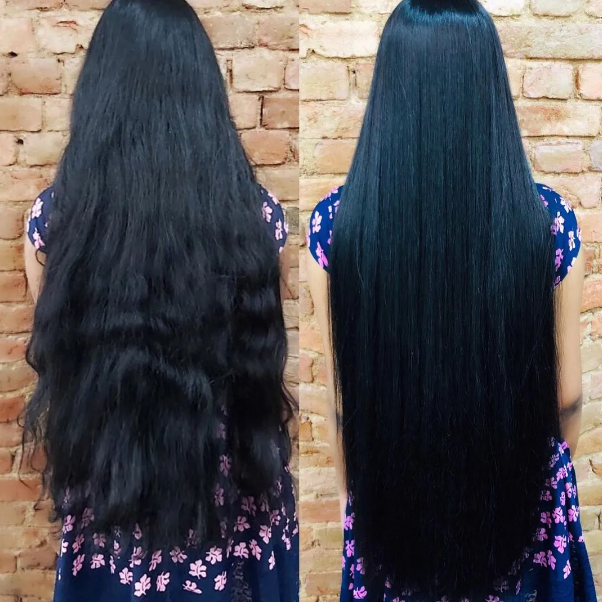

**Bond builders:**
A more recent trend is to target specifically the compounds that make your hair strong. Your hair is made out of compounds called disulfide bonds that are responsible for how curly your hair is and how strong it is. When hair is damaged either from heat styling, environmental factors, hair coloring and other factors, then disulfide bonds are damaged and makes the hair weak. While regular hair conditioners and shampoos do contain hydrating ingredients that also help to repair disulfide bonds, some products claim to be much more efficient. These bond builders can be in all sorts of products, ranging from shampoos to hair masks and serums. One of the most famous brand marketing their products specifically for repairing disulfide bonds is Olaplex.

**Serums:**
In hair care serums can provide extra hydration, protection or other specialized hair care. These products usually are lightweight and contain humectants and require emollients such as oils to be applied on top of them. Hair serums are not required, but can give an extra boost to some hair types.

**Oils:**
In hair care all sorts of oils are used, their main use case is to act as an emollient and prevent hydration from escaping your hair and protecting your hair from harsh environments at the same time. Some oils are more lightweight, some oils are more heavy and can weigh down your hair. Almost all oils leave a slightly tined layer on your hair that can change the color of your hair temporarily, this is especially relevant for blonde hair. When oils are present on your hair strands, then hair cannot get enough hydration, for this reason it is important to rehydrate the hair on regular basis.

**Heat protector:**
Special type of product that is meant to protect your hair from heat when heat styling tools are used. These products add a thin film on your hair strands that prevents the hair strand from reaching high temperatures that can damage the hair. It is highly recommended to always use heat protectants when using heat styling. Heat protector act similar to emollients and doesn't allow your hair to absorb moisture from the environment thus requiring regular rehydration.

**Dry shampoo:**
More of a hair refresher than a shampoo, they are based on alcohol or starch and they work by removing excess oils and dirt from your scalp. They are quite drying on your hair and should not be used too often if you have dry hair. With time your scalp can produce more oil and these oils can weigh down your hair, dry shampoos are a quick way to restore volume to your hair.

**Dye:**
There are two types of dyes: temporary and permanent. When temporary hair dye is used, the dye coats the hair strands with a thin film, but this film can be washed off using a shampoo once or twice. Permanent hair dyes on the other hand penetrates the hair's cuticles (outer layer of hair) and bonds with the hair's cortex (middle layer of hair strand) making the hair permanently dyed (or until new hair has grown). While temporary dye adds a thin coating that prevents the hair to absorb moisture, the coating can be removed and your hair can revert back to previous state in most cases. Permanent dyes alert the hair's structure, adding a darker tone usually is not very damaging, but your hair still will appear dry and prone to breaking. Permanent dyes make hair less smooth therefore harder to manage. Many permanent hair dyes contain harsh chemicals such as Ammonia, Ethanolamine, Hydrogen peroxide and many others, while they are effective and most dyes are made of them or similar chemicals, they are very likely to damage your hair, avoid such harsh chemicals as much as possible. There are natural options such as using Henna to dye your hair too. Never mix Henna with Hydrogen peroxide as it can severely damage your hair do to an unwanted chemical reaction.

**Color enhancers:**
Similar to dyes, these products add extra color to your hair. This is done mostly because of two reasons: to reduce a certain tone or to enhance a specific color. Most commonly purple shampoos are used for blonde hair to remove brassy tones, this is done by adding a thing coating of purple that when combined with brassy tones appear as brighter blonde tones. The added coating wears off and needs to reapplied, usually weekly. There are also color-depositing shampoos that adds more of a specific color to enhance existing color, for example, to deposit more pink tones. In general color enhancing products are not going to damage your hair as long as you follow the directions properly, otherwise the added color can penetrate deeper into your hair strands and create an unwanted hair color. These are some of the most popular hair color enhancers:
- Purple shampoo (to cancel out yellow tones)
- Green shampoo (to cancel out red tones)
- Blue shampoo (to cancel out orange/red/copper tones, mostly for color treated brunettes)
- Color depositing shampoo (adds almost any color to your hair)

**Bleach:**
This is a special type of hair dying process that deserves a chapter on its own since bleaching requires special care. Dyed hair care is very similar to bleached hair care, refer to the the appropriate chapter for more information.

Note: Some products will have a pH level specified. These products are specifically designed to be as least irritating your hair as possible. 
When pH level is above 5.5, your hair's cuticles start to open up and allows moisture to escape and causes more frizz to your hair. Your scalp is slightly acidic and the best pH level for hair care products is between 4.5-5.5. Look for products that either lists a specific pH level or labels themselves as "pH balanced".

Note: If you have dense hair, it might be difficult to apply a product throughout your hair, especially to hair that is in between the inner and outer layer of hair. If you notice that some parts of your hair appears dry or is hard to manage, then consider separating your hair and applying hair care products to each hair sections separately.

# Hair styling products and tools

There are a lot of ways to style your hair. To not be overwhelmed from the sheer amount of variety, read further to find the right styling products and tool for your hair type.

**Pomade:**
Comes in either oil or water based form. Oil-based pomade is made out of grease of petroleum, gives a high level of shine with a slick look, very hard to wash out, not suitable for everyday use. Water-based pomade can give matt or glossy finish, easy to wash out, loses hold when touched.
- Hold: medium to high
- Shine: high
- Oil-based pomade suitable for dry hair, high hold, glossy finish
- Water-based pomade not suitable for dry hair, medium hold, matt or glossy finish
- Suitable for thick hair
- Suitable for comb-over hair styles
- Suitable for thin and straight hair (if going for a wet look)
- Suitable for wavy, curly hair

**Hair wax:**
Made out of beeswax, carnauba wax or lanolin. Gives the flexibility to re-style your hair throughout the day.
- Hold: low to medium
- Shine: medium to high
- Suitable for messy hair styles
- Suitable for dry hair
- Suitable for thick hair
- Suitable for straight hair
- Not suitable for hair styles with structural integrity
- Not suitable for thin, wavy hair

**Hair paste:**
Universal styling tool. Best results are when used together with a blow dryer. Mostly water-based, easy to wash out. 
- Hold: medium to high
- Shine: low to medium
- Suitable for almost all hair styles
- Can be used for volume
- Can be used for hair separation
- Suitable for thin hair for high hold, thick hair can used for preventing poofy hair

**Hair clay:**
Similar to hair wax. Designed for higher hold and more matte effect. Adding hair clay to roots gives volume.
- Hold: medium to high
- Shine: low to medium
- Ideal for textured hair styles
- Suitable for straight hair
- Suitable for thick hair
- Suitable for oily hair
- Medium to short hair
- Great for messy hair styles
- Easy to comb
- Not suitable for thin, wavy hair

**Hair putty/mud:**
- Hold: medium to high
- Shine: none to low
- Ideal for easy messy hair styles to add texture
- Ideal for short hair
- Suitable for straight hair
- Creates matte effect

**Fiber:**
Resembles dried out wax with tackiness. Should be applied on dry hair. Usually comes in foam, wax or cream form.
- Hold: high
- Shine: none to low
- Suitable for messy looks
- Hard to comb
- Short to medium hair length
- Suitable for thick hair

**Hair cream:**
Usually made out of amino acids and oils. Can be in a thick or light consistency. Feels lightweight. Considered as the best product for thin hair.
- Hold: low
- Shine: low to medium
- Medium to long hair
- Suitable for frizzy hair to manage hair
- Suitable for thinning and fine hair
- Suitable for curly hair

**Styling powder:**
More recent product. Absorbs excess oils and boost volume. Can leave your hair feeling crunchy.
- Hold: low
- Shine: low
- Not suitable for coarse and dry hair
- Suitable for fine, straight hair
- Suitable for short to medium hair

**Sea salt spray:**
Creates a natural look. Has a low hold, but enough to be seen as styled. Removes excess oils. Can dry out hair too much. 
- Hold: very low
- Shine: low
- Suitable for separated hair look
- Not suitable for dry hair, suitable for oily hair
- Suitable for all hair length 
- Suitable for thin hair

**Sugar spray:**
Similar to sea salt spray, but without the drying effect. Adds less texture than sea salt spray.
- Hold: very low
- Shine: low
- Suitable for dry and coarse hair
- Creates slight texture
- Suitable for long hair

**Hair gel:**
Used to create "spikes". Look for alcohol-free hair gels. 
- Hold: medium to very high
- Shine: medium to very high
- Glossy or matte finish available
- Suitable for short to medium hair
- Suitable for thick hair, not suitable for thin hair

**Mousse:**
Widely used by celebrities. A small amount is sufficient. Should be applied to roots on damp hair. Must be blow dried. Finding the right mousse can be difficult.
- Hold: medium to high
- Shine: medium to high
- Creates volume and control
- Medium to long hair
- Not suitable for wavy hair
- Suitable for thin hair

**Hair spray:**
Best used together with other products a finishing styling product.
- Hold: low to high
- Shine: low to high
- Can add volume if applied to root, or hold hair if applied on the outer layer
- Suitable for thinning hair
- Suitable for high humidity
- Suitable for medium hair length

**Curl enhancer:**
These are usually leave-in hair conditioners combined with hair styling ingredients. Increases curl definition and clumping. 

**Detangling spray:**
Type of leave-in hair conditioner that moisturizes your hair strands. Creates a thin coating. Be sure to wash out the product on regular basis to allow your hair to absorb moisture, detangling sprays can prevent moisture to be absorbed properly.

**Anti-frizz sprays:**
Similar to detangling sprays, anti-frizz sprays add moisture and create a thin coating. Some of them can be used on wet hair, some are designed for dry hair.

**Comb:**
There are many types of combs and each have their own use case, here are some of the most common comb types:
- Paddle brush: Best for thick hair.
- Wooden bristle brush: Suitable for all hair types. Detangles hair gently.
- Wide tooth comb: Best for long and curly hair.
- Vented brush: Best for short and fine hair.
- Pitchfork comb: Best for curly and short hair.
- Styling comb: Universal comb that allows to section your hair and comb it, in a single tool.
- Small round brush: Best for frizzy hair while using a blow dryer.
- Metal round brush: Best for frizzy hair while using a blow dryer, not suitable for fine and medium hair.
- Fine tooth comb: Best for straight hair, not suitable for thick and tangled hair.
- Rat tail comb: Used for creating hair sections.
- Wooden comb: Absorbs some of hair oils. Can develop bacteria/fungi over time.

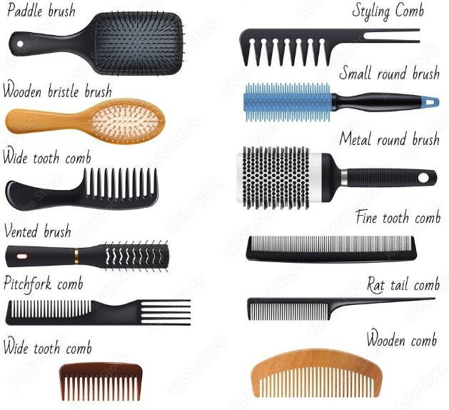

**Straighteners:**
A heat styling tool that work by applying heat to your hair strands and by pressing two plates together to iron your hair. Creates a lot of damage to your hair, for this reason it is very important to use a heat protector. There are three common hair straightener types:
- Ceramic plates: Most common, suitable for all hair types
- Tourmaline plates: Creates negative ions to fight hair frizz, allows to keep the hair's shine
- Titanium plates: Heats up fast

**Curling irons:**
A heat styling tool that. These tools heat up your hair to make them soft and when the curling iron is removed, the hair stays curled. Make sure you always use a heat protector since curling irons can severely damage your hair. They also come in various diameters to achieve either wide or narrow curls. There are 3 types of curling irons:
- Marcel: Gives a professional polished look
- Spring and clamp: Gives you the traditional "S-type" curls
- Wand: Gives you tousled curls

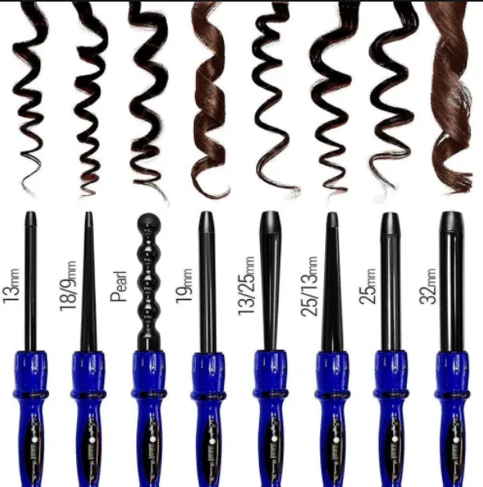

**Hair rollers:**
There are many types of hair rollers, but all of them work on the principle of placing a cylinder shaped object into your hair and leaving it for extended period of time. Some of them use heat, but some of them don't rely of heat. These are some of the common hair rollers:
- Velcro rollers: Old-school hair rollers that has a velcro surface, does not require heat
- Steam rollers: a heat styling tool, uses less heat than an curling iron, is applied to your hair for about 20 minutes, remove from hair when they are cold
- Flexi rods: Apply to slightly damp hair then either use a blow dryer or leave it in over night
- Foam rollers: Soft sponge-like rollers, ideal for leaving in for the night, works on dry hair too. Suitable for all hair tpes
- Jumbo rollers: Gives instant curls, placed inside a heating device to heat up the rollers then the rollers can be applied to your hair. Comes in various sizes

**Blow dryers:**
A heat styling tool that works by blowing either hot or cold air against your hair. It is used for both drying hair and locking in a hair style. Common parameter is wattage, the higher the faster it can dry. Usually 1800W is enough for most cases, but thin and fine hair can use less powerful blow dryers. Blow dryers can come with an AC or DC motor, AC being more powerful and DC being more lightweight. The motor can also be a brush-less type that can last longer and be more quiet. Usually blow dryers can last up to 1000 work hours, a higher quality one is expected to last longer while cheaper ones are expected to break a lot sooner.
- Tourmaline (ionic): Make sure it is made out of tourmaline and not just coated with tourmaline. When tourmaline is heated, it starts to emit negative ions that removes static electricity from your hair. The heat itself heats up your hair strands to dry them out. Suitable for thick hair.
- Ceramic (porcelain): Heats up quickly and evenly, suitable for thin hair and curly hair.
- Infrared: Heats the hair strands inside out by using infrared light. Suitable for dry, damaged and color-treated hair. High cost. 
Blow dryers also come with a few different types of attachments designed for specific use cases:
- Concentrators: concentrates the air flow to a specific area to minimize heat exposure to other areas, suitable for thick hair.
- Diffusers: reduces the intensity of air flow, suitable for curly hair
- Picks or combs: used to create hair styles while applying heat.

Note: The button on your blow dryer is meant to quickly change to cold air. This is very useful when styling your hair. Your hair becomes soft when it is heated, you can use that to create various hair styles, but your hair becomes hard when it is cold. You can use the cold air to lock-in your hair style.

# Hair care routines

With all the possible products you can use, hair care might seem very overwhelming, but it should not be that way. While there is no clear answer to what your specific hair needs, you should be able to find what works for you with a few simple steps and a few trials.

Bellow is the most basic hair care routine you can follow and still see good results:
- Wash your hair with a shampoo designed for your hair type on regular basis (frequency depends on your hair type).
- Apply hair conditioner designed for your hair type and wash it out after the specified time mentioned on your conditioner.
- Allow your hair to air dry or apply a heat protector and blow dry your hair.
- Done.

As you can see, if your hair does not have any specific concern, then all you need is a shampoo and a conditioner. This routine is relevant for most people with short to medium length hair since shorter hair is able to receive enough hydration from hair roots. There are some 2-in-1 shampoo/conditioner products that can be used for shorter hair, but they are not very efficient and separate shampoo and conditioner should be used instead.

To people who want to improve their hair care routine to the next level, consider the following routine:
- Wash your hair with a shampoo designed for your hair type on regular basis (frequency depends on your hair type).
- Apply hair conditioner designed for your hair type and wash it out after the specified time mentioned on your conditioner.
- Apply a hair mask designed for your hair once a week, wash it out after the specified time mentioned on your hair mask (skip conditioner on the day you use a hair mask)
- Allow your hair to air dry or apply a heat protector and blow dry your hair.
- Done.

The hair routine mentioned above is highly effective for most people with longer hair. With proper hair care products designed for your hair type you should be able to get very good results that can make other people envy your hair.

To take a step further for people with dry hair, you can consider the following hair routine:
- Wash your hair with a shampoo designed for your hair type on regular basis (frequency depends on your hair type).
- Apply hair conditioner designed for your hair type and wash it out after the specified time mentioned on your conditioner.
- Apply a hair mask designed for your hair once a week, wash it out after the specified time mentioned on your hair mask (skip conditioner on the day you use a hair mask)
- Allow your hair to almost dry fully either by air drying or by applying heat protector and blow drying them almost fully dry.
- Apply hair oil on your hair ends designed for your hair type each time you wash your hair.
- Done.

The routine listed above is probably the most popular hair care routine for long hair women. The most popular concern for long hair women is that their hair ends are splitting or are dry. A proper hair oil applied to slightly damp hair can do wonders.

If your hair is severely damaged and you want to get the most effective routine to restore your hair:
To take a step further for people with dry hair, you can consider the following hair routine:
- Wash your hair with a shampoo designed for your hair type on regular basis (frequency depends on your hair type).
- Apply hair conditioner designed for your hair type and wash it out after the specified time mentioned on your conditioner.
- Apply a hair mask designed for your hair once a week, wash it out after the specified time mentioned on your hair mask (skip conditioner on the day you use a hair mask)
- Allow your hair to almost dry fully either by air drying or by applying heat protector and blow drying them almost fully dry.
- Apply a hair serum designed for your hair type on slightly damp hair each time you wash your hair or in the morning/evening/both when hair is slightly damp.
- Apply hair oil on your hair ends designed for your hair type each time you wash or morning/evening/both when hair is slightly damp.
- Done.

The hair care routine listed above is a complex hair care routine that requires a lot of persistance. The idea is to hydrate and protect your hair as many times as possible. The most common way is to spray filtered water on your hair to make it damp each evening before bed and applying both a serum and an oil to your hair before going to bed, but this can also be done in the morning or both. While this routine is going to be highly potent, it might not be very cost and time effective.

To take your already over-kill hair care routine to the next level, consider the following routine:
- Wash your hair with a shampoo designed for your hair type on regular basis (frequency depends on your hair type).
- Apply hair conditioner designed for your hair type and wash it out after the specified time mentioned on your conditioner.
- Apply a hair mask designed for your hair once a week, wash it out after the specified time mentioned on your hair mask (skip conditioner on the day you use a hair mask)
- Apply a protein hair mask once a month designed for your hair type, wash it out after the specified time mentioned on your hair mask (skip your conditioner and your regular hair mask on the day you use a protein hair mask)
- Allow your hair to almost dry fully either by air drying or by applying heat protector and blow drying them almost fully dry.
- Apply a hair serum designed for your hair type on slightly damp hair each time you wash your hair or in the morning/evening/both when hair is slightly damp.
- Apply hair oil on your hair ends designed for your hair type each time you wash or morning/evening/both when hair is slightly damp.
- Done.

The difference in this hair care routine is to include a protein treatment option at home once a month. This added treatment can give you restored hair health if it is severely damaged thanks to protein treatment and proper hydration.

But if you are here for the absolute best possible hair care routine that makes probably no sense (despite finding sense in the previous routines that are already over-kill for most people), then consider the following routine:
- Apply bond building treatment on damp hair once a week
- Wash your hair with a shampoo designed for your hair type on regular basis (frequency depends on your hair type).
- Apply hair conditioner designed for your hair type and wash it out after the specified time mentioned on your conditioner.
- Apply a hair mask designed for your hair once a week, wash it out after the specified time mentioned on your hair mask (skip conditioner on the day you use a hair mask)
- Apply a protein hair mask once a month designed for your hair type, wash it out after the specified time mentioned on your hair mask (skip your conditioner and your regular hair mask on the day you use a protein hair mask)
- Allow your hair to almost dry fully either by air drying or by applying heat protector and blow drying them almost fully dry.
- Apply a hair serum designed for your hair type on slightly damp hair each time you wash your hair or in the morning/evening/both when hair is slightly damp.
- Apply hair oil on your hair ends designed for your hair type each time you wash or morning/evening/both when hair is slightly damp.
- Visit a hair saloon every 4-6 months for a heated keratin treatment.
- Done.

The added bond building treatment along with keratin treatment is going to give you as straight and healthy looking hair you can get (except for even more extreme methods that include talking to your doctor). Be aware, the routine is not for everyone, it is going to be incredibly expensive and time consuming. You can consider taking only a few steps out of a more complex routine to find what works best for your hair. As well as keratin treatments are not suited for curly and wavy hair types. Don't go overboard with the possible hair care options, start small.

Note: Consider visiting a hair saloon on regular basis (1-3 months) to trip damaged hair ends and keep them looking healthy.

# Dandruff treatment

Due to person's age, hair product use, stress levels, various medical conditions and many other factors, it is possible for a person to develop dandruff on their scalp. Usually it is quite a simple fix, but sometimes it can be a bit difficult to treat dandruff especially with some hair types.

The human body can create a balance of good bacteria and fungi all over your body, but sometimes fungus growth becomes uncontrollable. When this happens on your scalp, you start to experience dandruff. The fungus is being fed with your scalp's oils and creates white flakes. 

Note: Many people think that dandruff indicates dry scalp, but in reality the white flakes are from excessive skin cell production. Adding various oils to the scalp will make the condition a lot worse.

There are multiple ways to treat dandruff, but first lets cover some of the most common things that cause dandruff:
- Adding hair conditioner to your roots
- Not washing your hair properly
- Using the wrong hair products (including hair styling products)

Before jumping out of your seat and getting anti-dandruff treatments, make sure you are not making the most common mistakes listed above. First common mistake is put conditioner and various hair masks on your roots, this applies to almost all hair care products - if it does not say to put it on your hair roots, then you should not put it on your scalp. Second common mistake is not washing your hair throughout or not washing frequently enough (based on your hair type, don't over wash it either), you are supposed to massage the shampoo into your hair roots and let it sit for while (for regular shampoos it should be about a minute of massaging your scalp gently), and you are supposed to wash out all of the shampoo afterwards, not just rinse it slightly. Third mistake is to use the wrong products, you are not supposed to use a shampoo for dry hair if you have oily hair, similarly you are not supposed to use hair oils if you already have oily hair.

Dandruff is being fed with (almost) all types of oils. Sadly almost all hair care products contain these oils that dandruff can feed on and make your condition worse. In skin care it is possible to find products that are fungal acne safe, similar products would work great for dandruff too since the cause of both problems is the (almost) same fungi. Unfortunately in hair care finding products that don't contain ingredients that feed fungi is absurdly hard and not worth chasing. The same oils that make your hair smooth and shiny are also feeding the fungi. Luckily you can improve your chances dramatically in fighting dandruff by simply not putting on hair care products (except a shampoo) on your scalp and in many cases you can fight dandruff successfully as long as you use the proper shampoo and avoid putting other products on your scalp (some exceptions do exist).

The most effective way to combat dandruff is to use active ingredients. Below are some of the most popular active ingredients that target dandruff:
- Pyrithione zinc: most common, considered as most gentle, might be hard to find in Europe
- Salicylic acid: helps remove excess product build-up and excess fungi, can cause dry scalp if used too often
- Selenium sulfide: most effective against itching and flakes, can cause dry scalp and burning sensation
- Ketoconazole: targets growth of fungi, can contribute to prevent hair loss

Note: Ketoconazole and Pyrithione zinc is a commonly used to fight fungal acne on your skin too!

Some of the active ingredients work better for some, so if you are struggling with stubborn dandruff, then consider looking for products that has one of these active ingredients and switch to a different active ingredient if you don't see results after 1 month.

In general you should avoid putting anything on your scalp other than a shampoo, especially if you have dandruff. There are some hair serums that can be used on your scalp, but some of these serums are not suitable if you already have dandruff. For those who have dandruff, you should use only hair serums without ingredients that trigger malassezia growth. Determining which ingredients trigger malassezia growth is out of the scope of this guide. For simplicity, you should assume that all hair products (except shampoos) are going to make dandruff worse if you put them on your scalp, but these products are fine to be used on your hair ends.

Be sure to properly follow the instructions on your anti-dandruff shampoo, do not use it more often than specified on the label as it can dry out your scalp and make your condition worse, usually these shampoos should be used once or twice a week. If you feel that you need to wash your hair more frequently, consider finding a very mild shampoo to use throughout the week.

If you are still struggling with dandruff even after trying multiple products with different kinds of active ingredients, then consider going to a doctor to find the root cause of your dandruff.

# Bleached/dyed hair care

Bleached and dyed hair is one of the most damaging procedures you can do on your hair. When (permanently) dying or bleaching your hair, you change the structure of your hair by binding harsh chemicals with your hair's cortex. While your hair gets the color you always wanted, your hair becomes severely dry and damaged. Both dyed and bleached hair requires intense hair care routines to restore your hair's health.

Note: While dying and bleaching are very different procedures, the same hair care principles apply to both of them.

It is possible to dye and bleach your hair at home, but since it is extremely easy to damage your hair to a point where you experience severe hair loss, it is highly recommended to visit a professional for such procedures. This guide will not cover how to do such procedures properly, this guide will rather focus on how to care for your hair in order to minimize the damage after these procedures.

Before dying or bleaching your hair you must make sure that your hair is in good condition. Make sure your hair is not dry. You must have a good hair care routine before going to such procedures beforehand. Check the guide to make sure your hair is not damaged nor dry already, your hair needs to be properly hydrated and you need to use products that are suitable for your hair. After dying or bleaching your hair, you can expect that your hair is going to become dry, damaged, prone to breakage, very fuzzy, hard to manage and looking very dull (especially when bleaching).

To combat the unwanted side effects you must make sure your hair receives all it needs before going in for a procedure. If you skip a proper hair care routine, then you will most likely regret dying or bleaching your hair soon after the procedure as the side effects are going to be severe. Focus on making your hair hydrated, make sure you use mild shampoos and proper conditioners that are designed for your hair type.

Note: You can opt for a protein treatment for your hair shortly before going in for a dying or bleaching procedure, this can help to minimize the unwanted side effects.

Your saloon specialist will give you directions after the procedure. You should avoid washing your hair for 48-72 hours, this allows your color to be sealed in. Avoid using heat styling tools for a as long as you can since they can severely damage your hair even further. Avoid being in direct sun exposure for two weeks to prevent the color from fading and to prevent keratin in your hair strands from being broken down due to UV exposure.

You are most likely going to need new hair care products though existing products might work fine too. Expect you hair type to become to dry hair so adjust your hair care routine to one that intensively targets dry hair. It is highly recommended to opt for hair masks, hair ols and leave-in conditioners (or serums) to treat your dyed or bleached hair. You will need all the hydration possible, but don't go overboard with it. Consider using a shower head filter if your tap water is too hard.

Most common issue with bleached and blonde hair is that they develop a brassy tone over time. To combat this, you need to use a purple shampoo once a week after washing your hair with your regular shampoo. These shampoos create a thin coating that neutralizes brassy tones by adding a purple tone on top of it. There are hair masks and conditioners that contain purple pigments that are designed for the same purpose.

Be aware of various hair oils and hair care products that contain oils when used with bleached and blonde hair. Most of the oils you will find create a thin coating on your hair strands that is not translucent, as a result these oils can change the hair's appearance and can make it seem that your blonde hair is with brassy tones all the time. Almost all oils will stain your hair, there are a few exceptions such as sunflower seed oil that does not stain your hair. There are also other products (hair masks, conditioners and others) that are specifically designed for blonde and bleached hair to prevent an unwanted color change.

Note: There are products designed for specific hair colors as well. Opt fot such products to preserve your hair color.

When your hair has been recovered from intense abuse (dying/bleaching), you can consider getting a keratin treatment done by a professional no sooner than 4 weeks after bleaching or dying your hair. These keratin treatments use heat to enhance the effect of the keratin treatment, but the heat can severely damage your hair if it is already damaged from dying or bleaching.

Note: Some keratin treatments can change the color of your hair. Make sure you ask your saloon specialist whether the selected treatment does not affect your hair color.

You are most likely going to experience split ends. There is no way to recover from split ends, your best option is to hydrate your hair as much as possible and getting regular trims at your saloon.

# Ingredients

Hair care products are made out of various ingredients, but not all of them are good for you hair. Ingredients list makes it clear of what the product is made of and the information can be used to get an understand how the product performs. These list contain two types of information: the actual ingredient and its relative volume in the product. When reading an ingredients list, the ingredients are ordered in a sequential order by its volume, this can give you a rough idea on how potent is the product compared to similar products.

There are countless ingredients that can be found in various products. Here are the most important types of ingredients in hair care:

Solvents: Used to dissolve other ingredients. Usually it is just water or alcohol.

Alcohols: Used as solvents to remove excess oil. It is also used to increase the potency of another ingredient since stripping excess oils allows potent ingredients to be delivered faster to the hair strands. As a side effect, alcohols make hair dry faster, which is sometimes desired. Not all alcohols are the same, short-chained alcohols (ethanol, propanol, isopropanol and others) are considered "bad", but there are other alcohols that are considered less disruptive.

Humectants: Used as hydrating agents, they are able to draw in moisture and release it over time. Humectants can make hair more dry if there is not enough moisture in the environment or inside the hair, this means that humectants draw moisture out from hair, but they release it back over time. This ability makes a good ingredient that can slowly hydrate your hair over time. Humectants are usually combined with emollients to prevent moisture being released into the environment.

Emollients: Used as "sealing" agents that prevents moisture from escaping and entering the hair strands. Most popular emollients are oils that can be considered as thick emollients, but other emollients such as silicones exist too. Emollients do not hydrate, they only seal in the moisture, this means that for proper hydration emollients must be combined with humectants. EMollients also serve as protection from the environment including wing and some emollients (specifically Vitamin E) can serve a limited UV protection function.

Proteins: A building block for human body that also affects hair structure. Up to 85% of your hair is made out of protein (specifically keratin). With a good diet that has plenty of protein you can ensure proper hair growth. Some hair care products include proteins that act as emollients and smooth out your hair strands.

Keratin: A type of protein, very commonly found in various hair care products. Keratin creates a small film on the hair to smooth out cells on your hair strands. This can make your hair easier to manage and less frizz. Together with other ingredients keratin strengthens hair. Due to created film on your hair strands, keratin can make some hair types too dry and become even more damaged.

Lipids: Type of a "sealing" agent that covers your hair strands, it is also a type of fatty acid. They are most effective when combined with keratin to form a strong hair structure. When your hair is lacking lipids, it is also lacking keratin since lipids are holding keratin together on your hair. Washing your hair can remove lipids and you might need to replenish them if your shampoo is not mild enough.

Peptides: Type of "sealing" agent that covers your hair strands and can penetrate into your hair strands and repair hair's damaged bonds.

Conditioners: As a type of ingredients, their function is to create a thin layer of a product that makes the hair easier to comb, improves the appearance, prevents damage and more. Conditioner is an umbrella term for many ingredient types including humectants, emollients, proteins, lipids, silicones and others.

Oils: A very common type of emollient. Does not hydrate your hair even though most Internet sources claim that oils can hydrate your hair. Nowadays there are many oils that can be found in hair care, each oil promises a different kind of effect on your hair. Since oils do contain fatty acids and various vitamins, they can have a noticeable effect on your hair. Oils are usually heavy and can make your hair weigh down and lose volume, though some oils are lightweight. Some oils can have a coloring effect and slightly change your hair's color, this is especially relevant for blonde hair.

Surfactants: In hair care there are two use cases for surfactants - foaming agents and conditioning agents. In shampoos, surfactants are used as foaming agents (cleaning), but in some products they are used as conditioning agents (hydration). There are many surfactants, many of them contain sulphates, but some modern surfactants are now sulphate-free. In shampoos surfactants can be harsh to your hair, but some surfactants are mild enough to be used even on damaged hair.

Fragrances: Ingredients that make the product smell good. While it might smell good, most fragrances are irritating to your hair and can cause allergic reaction. Sometimes manufacturers specify what kind of ingredients are used as fragrance, but in many cases they simply list a single entry called "fragrance/parfum". If possible, it is best to avoid fragrances in hair care products.

Sulphates: In hair care these are surfactants that are made out of sulphates. Most popular ones being sodium lauryl sulfate and sodium laureth sulfate. Their function is to remove excess oil and dirt from your hair. It is very common to read that sulphates are harsh on your hair, but that is not always the case. Some sulphates are mild enough to be used with even damaged hair.

Preservatives: Ingredients that prevents the product from going "bad". Many people want to avoid preservatives, but preservatives are the ones that keep the product from developing mold, prevents bacteria and fungi growth and in general protects you from harming yourself. Some preservatives are believed to cause adverse effects, but most preservatives are safe to use. There are even natural preservatives available, if you want to go all-natural and still be safe.

Parabens: Type of preservatives. They are highly effective when it comes to preventing all sorts of bacteria and fungi growth. Some studies have suggested that parabens act like estrogen and disrupts hormonal activities in your body that has been correlated to breast cancer. Parabens have been banned in Europe due to safety concerns.

Phthalates: In hair care it is used to prevent hair from becoming stiff, they are also used to create gel-like consistency in shampoos. It can also be used to reduce unpleasant smell in hair care products. Some phthalates have been correlated with asthma, mental disabilities and behavioral issues. Some phthalates are banned in Europe.

Anti-dandruff: Type of active ingredients that control fungus growth on your scalp. These ingredients can be harsh on your hair so it is best to use them only on your roots and only when needed.

Thickeners: Adds thickness to the product. This is not related to special shampoos called "thickening shampoos", these ingredients simply make your product not be too liquid. Most thickeners found in hair care products are safe to use.

Sequestering agents: Special chemicals that are most commonly used in hair care to prevent certain chemicals from forming. Commonly in hair care these ingredients are used to prevent insoluble soap (scum) from forming.

pH balancers: Ingredients that simply balance the pH level of the product to prevent the product from harming your hair by being too acidic or too basic.

Opacifier: Ingredients that make the product be opaque. With these ingredients the product has a pleasant visual consistency.

There are countless ingredients, it can be very overwhelming to read each individual product's ingredients list and try to understand how this product works. To ease the frustration, below is a list of most common ingredients found in hair care products. This list purposely has excluded their effects since the effect will depend a lot on your hair type and a lot on the overall formula, though this list will include comments on who should or who shouldn't use this ingredient as well as some other noteworthy comments.

Zinc Pyrithione: Anti-dandruff.
Hydrolised Silk Proteins: Protein, acts as a humectant.
Hydrolised Wheat Protein: Protein, acts as a humectant. 
Dimethicone/cyclopentasiloxane amodimethicone/cyclomethicone and others: Emollient. Silicone. Adds weight to hair.
Glycerine/Glycerol: Humectant.
Panthenol: Humectant. Vitamin B5. In large quantities can cause acne.
Sodium /Lauryl Sulfate (SLS):Surfactant. Can be too harsh for some hair types.
Sodium Laureth Sulfate (SLES): Surfactant. Milder than SLS.
Hydrolised Keratin: Protein.
Isobutylparaben/butylparaben/isopropylparaben/propylparaben: Paraben. Avoid.
Ethanolamine: Solvent. Lipid. Can cause more damage to hair than ammonia. Used in hair dyes. Avoid.
Diethanolamine/Triethanolamine: Emulsifier. Can cause hair damage. Avoid.
Cocamidopropyl Betaine: Surfactant.
Cetyl/Stearyl Alcohol: Emollient. Thickener.
Sodium Chloride: Thickener. Salt.
Ethanol/Propanol/Isopropyl Alcohol/Alcohol Denat: Alcohols. Not suitable for dry hair types.
Ceramide: Lipid. Emollient. Often added to bleaching agents.
Biotin: Protein. Usually found as a supplement, but can be found in hair care products too.
Hyaluronic acid/Sodium Hyaluronate: Humectant.
Sodium PCA: Humectant.
Formaldehyde: Preservative. Known to cause allergic reactions and irritation. Avoid.
Sorbitol: Humectant.
Stearic acid: Thickener.
Arginine: Protein.
L-Cysteine: Protein.
Citric acid: pH balancer.
Glycolic acid: ph balancer.
Phenoxyethanol: Preservative.
Hexachlorophene: Preservative. Can cause irritation. Avoid.
Argan oil: Emollient.
Olive oil: Emollient.
Mineral oil: Emollient.
Jojoba oil: Emollient.
Sunflower seed oil: Emollient. Contains up to 65% lipids. Not to be confused with sunflower oil. Does not stain blonde hair.
Sodium lauryl sulfoacetate (SLSA): Surfactant. Sulphate-free.
Sodium cocoyl glycinate: Surfactant. Sulphate-free.
Sodium cocoyl glutamate: Surfactant. Sulphate-free.
Disodium: Surfactant. Sulphate-free.
Sodium lauroyl methyl isethionate: Surfactant. Sulphate-free.
Sodium lauroyl taurate: Surfactant. Sulphate-free.
Sodium lauroamphoacetate: Surfactant. Sulphate-free.
Decyl glucoside: Surfactant. Sulphate-free.
Lauryl glucoside: Surfactant. Sulphate-free.
Polyphosphates: Sequestering agent.
Ethylenediaminetetraacetic acid: Sequestering agent.
Shea butter: Emollient.
Cocoa butter: Emollient.
Mango butter: Emollient.
Oryza Sativa (Rice) Bran Oil: Emollient.
Squalane: Emollient. Does not feed fungi compared to other oils.
Carnauba wax: Thickener.
Rosa Canina (Rose Hip) Seed Extract: Emollient.
Limnanthes Alba (Meadowfoam) Seed Oil: Emollient.
Carthamus Tinctorius (Safflower) Seed Oil: Emollient.
Cannabis Sativa (Hemp) Seed Oil: Emollient.
Xanthan gum: Thickener.
Limonene: Fragrance.
Hexyl Cinnamal: Fragrance.
Persea Gratissima (Avocado) Oil: Emollient.
Aqua/Water: Solvent.
Gelatin: Thickener.
Cetyl Esters: Emollient.
Sodium Benzoate: Preservative.
Caprylyl Glycol: Humectant.
Salicylic Acid: Anti-dandruff. Solvent.
Tocopherol: Emollient, but also can act as an humectant. Vitamin E. Has limited UV protection properties.
Potassium Sorbate: Preservative.
Coconut Oil: Emollient.
Propanediol: Solvent.
Linalool: Fragrance.

# Hydration and oils

There seems to be a very misleading assumption spread over the Internet that oils can be hydrating, but this is false and it is important to understand this in order to properly take care of your hair.

To hydrate your hair, you need water. The water can be inside various chemicals, but as long as your hair is able to extract water, then your hair is going to be hydrated to some extent. Water has a downside - it can evaporate. If you simply put water on your hair, it is most likely (depending on your hair type) going to evaporate before your hair is able to absorb it. For this reason water is added to different kinds of products to reduce the evaporation rate.

Another interesting type of hydrating chemicals is humectant. These chemicals absorb moisture, but it does that both ways - it can absorb water from the environment and it can absorb water from your hair, this makes humectants a double edged sword. Humectants can hydrate your hair and it can make it dry.

Oils on the other hand do not provide any moisture. Water does not diffuse in oil, it floats in water, but due to this characteristic oils are used heavily in hair care. Oils seal in moisture, oils do not hydrate on their own. This means you must not apply oils on dry hair, you should apply oils only on damp hair to prevent moisture from escaping your hair strands. Applying oils on dry hair prevents moisture from going in and from going out, this means that an oil will make dry hair even dryer.

Similar effects can be noticed from other emollients. One interesting case is with proteins that are supposed to create a thin film on your hair strands and are considered as highly effective when it comes to repairing damaged hair, but protein can prevent your hair from receiving hydration thus experiencing a common complaint with protein treatments - it can make hair more prone to damage and more dry.

The way how oils work in hair care should make you question the efficiency of those products that contain both water and oil in the same product. It is much more efficient to apply a hydrating product first and then apply an oil afterwards, this method is very popular in skincare. But oils also have a nourishment function, most oils are full of fatty acids that can make hair more healthy. It is still more efficient to get separate hydrating product and a separate oil for best results.

# FAQ

Q: How do I make my hair grow faster? Does X going to speed up hair growth?
A: In general, you should have a good diet and get plenty of Vitamin B (especially biotin), Vitamin D, Vitamin E, iron, zinc and other essential vitamins and minerals. Proper hair care such as proper hydration to prevent hair breakage is also going to help hair growth. Your hair growth rate is mostly going to be limited by your genetics. Most products sold as hair growth treatments contain the mentioned vitamins or their efficiency is highly questionable.

Q: Are "natural" and "organic" products better?
A: Most of the ingredients found in wide range of consumer products are extracted from natural resources. During manufacturing, the natural resource is refined to a level that is safe to use. Natural products might or might not be refined making the product less safe for consumption in some cases. What makes a good product in hair care depends on its ingredients, how the combination ingredients interact with your hair and how high is the quality of the ingredients, there can be high and low quality natural products and same can be said for non-organic products. Be aware that natural products tend to have less preservatives that prevents the product from going "bad" meaning that the product must be consumed in shorter period of time. Be sure to strictly follow the expiration date that is listed on the product.

Q: More expensive means better, right?
A: Sometimes. One of the factors that impact the product's price is the manufacturing cost. A product might use a complex manufacturing technique that is more expensive that alternatives, but can deliver a different type of result. A product can also contain very exotic ingredients that are hard to source. A product can also be more expensive simply because of a brand. It is very hard to determine if the product is better than cheaper ones, ingredients sadly don't always show how the ingredients were manufactured and how were they refined. Your best option is to examine ingredients lists of various products and trying to guess why the product is more expensive. Sometimes the price is justified, sometimes it is not.

Q: My water in my shower is hard, what can I do about it?
A: Hard water can prevent your hair from receiving the proper hydration it needs, as a result your hair can still be dry and not feel supple. To combat hard water you are most likely going to need a proper water filter that removed unwanted particles for your specific water (use a proper water test to determine what kind of compounds are high in your local tap water), though such a system can be very expensive and hard to setup (might require a professional). Another option is to simply look for a generic shower head filter that filters most common compounds that cause hard water to some extend, many people report good results with even generic shower head filters that are many times less expensive than an installed water treatment solution in your home.

Q: Do essential oils work?
A: They sometimes smell good. That's about it.